# itelect2-project

My IT Elective 2 backend web development project

## API Testing (for GT6)

### GET /api/tasks

### POST /api/tasks
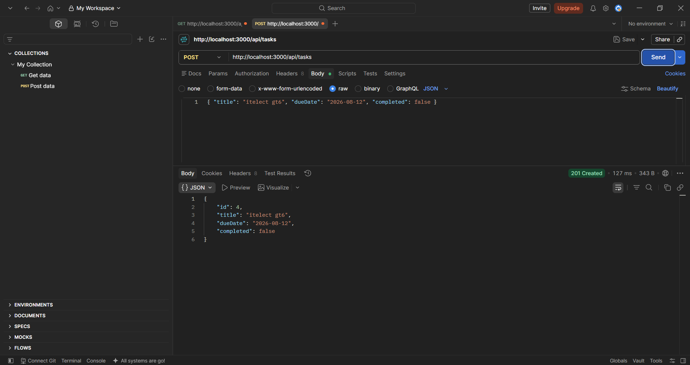

### PUT /api/tasks/:id
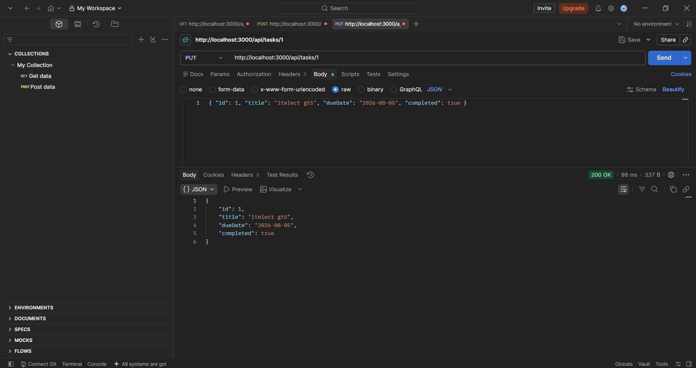

### DELETE /api/tasks/:id
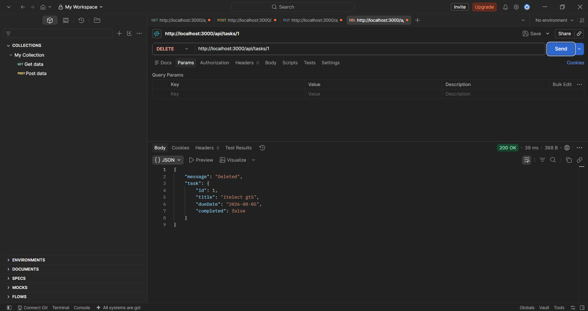

---

## API Testing (for GT8)

### GET /api/users
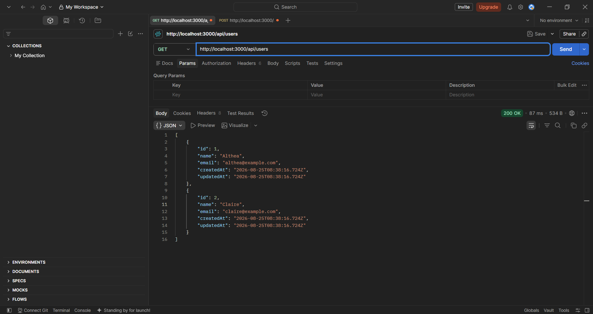

### GET /api/tasks
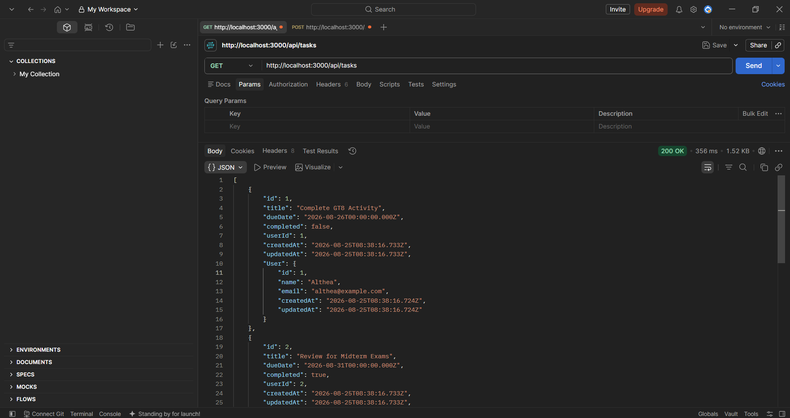

### GET /api/tasks/:id
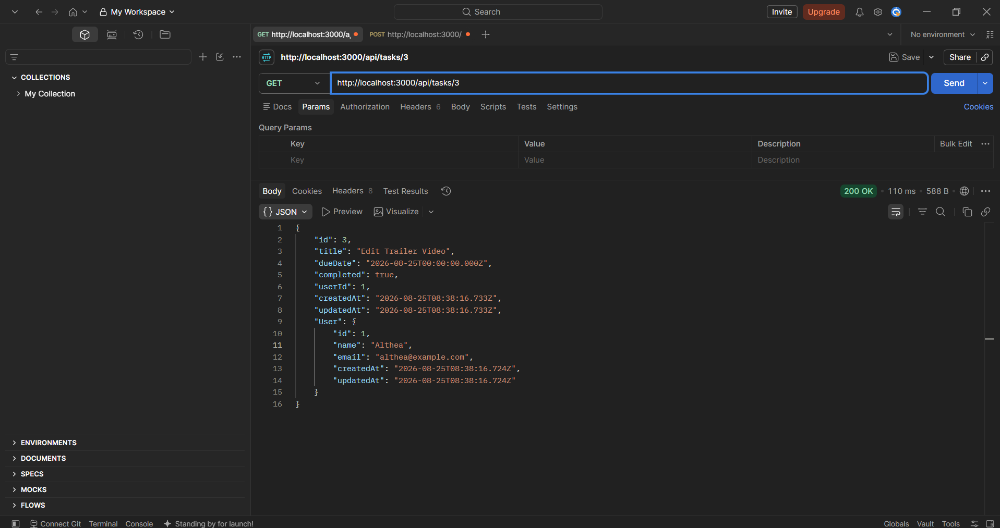

### POST /api/tasks
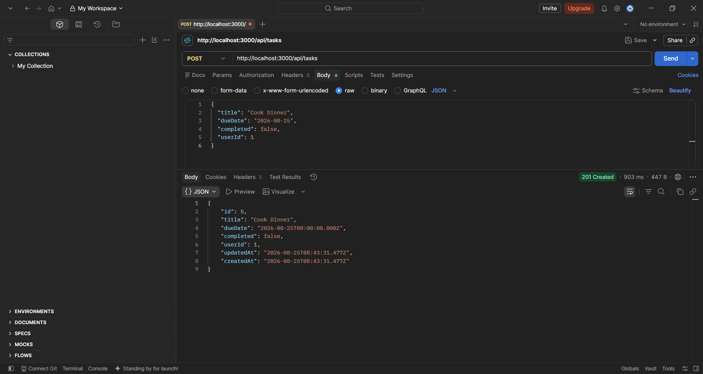

### GET /api/tasks (After POST)
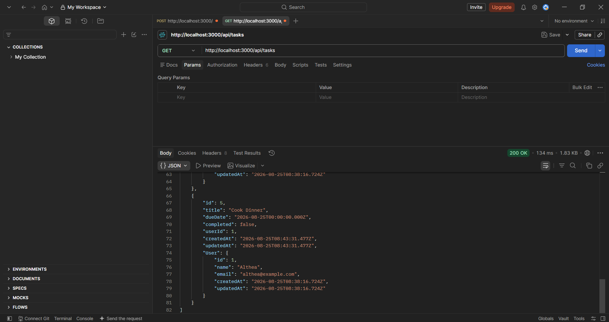

### PUT /api/tasks/:id
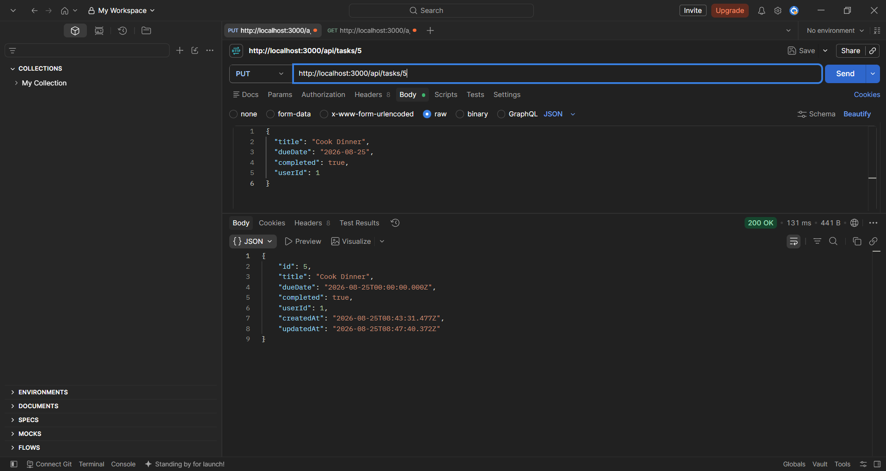

### GET /api/tasks (After PUT)
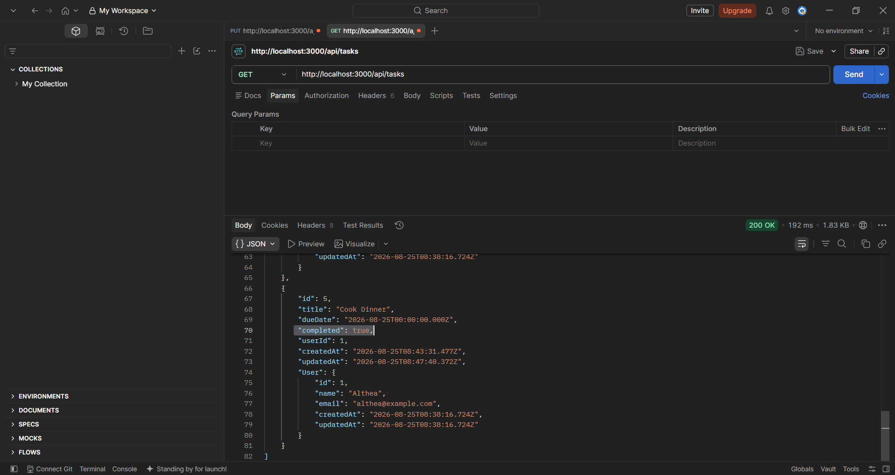

### DELETE /api/tasks/:id
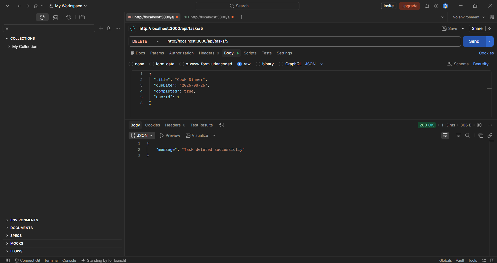

### GET /api/tasks (After DELETE)
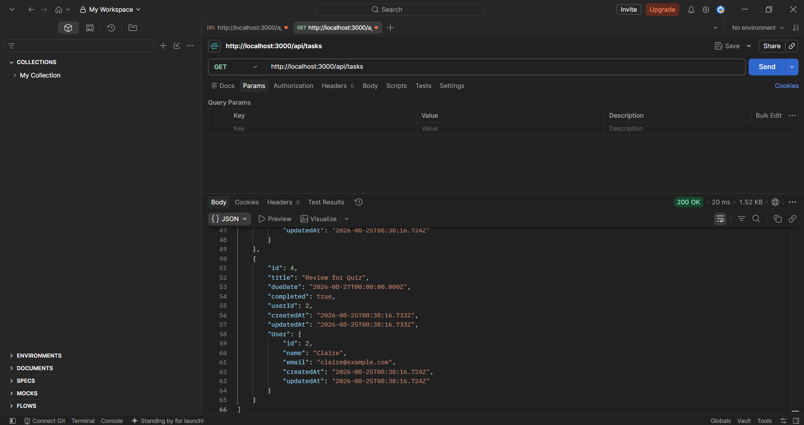

### Error Handling Sample
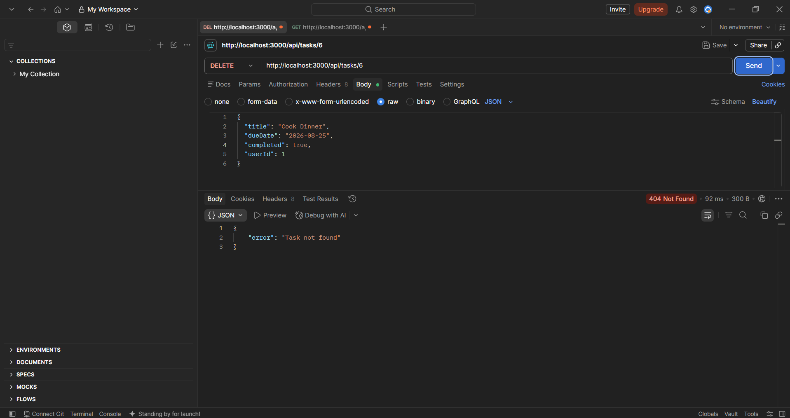